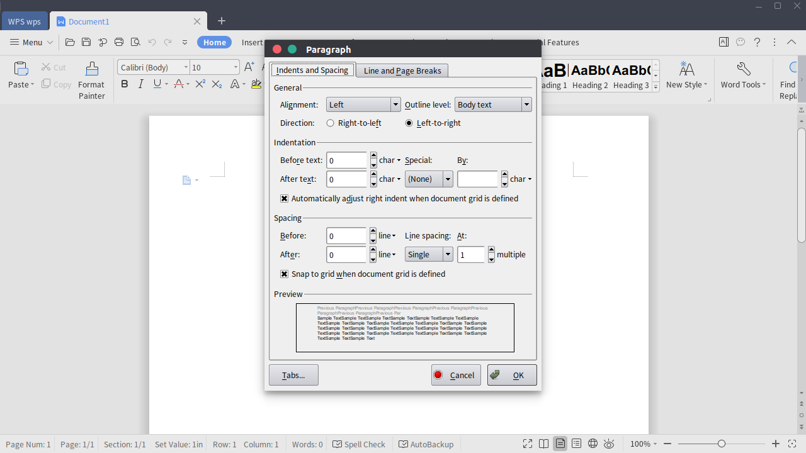

# Umix 19.04
## Changelog

**Fix for WPS Office theme issue**

WPS Office cannot handle dark themes correctly. A fix was added for this issue.

NOTE: This fix is useful only if you install WPS Office. WPS Office is not installed by default. 

