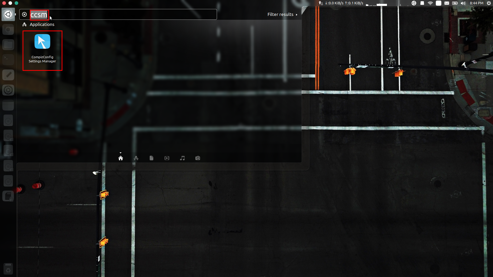
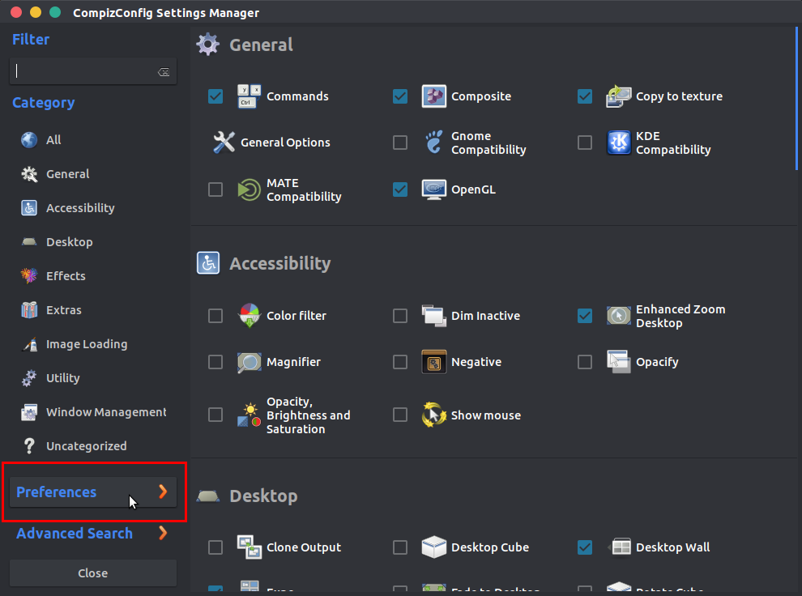
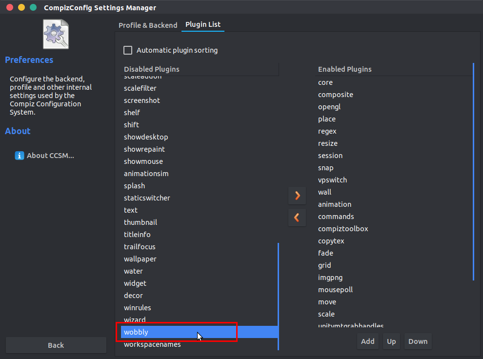
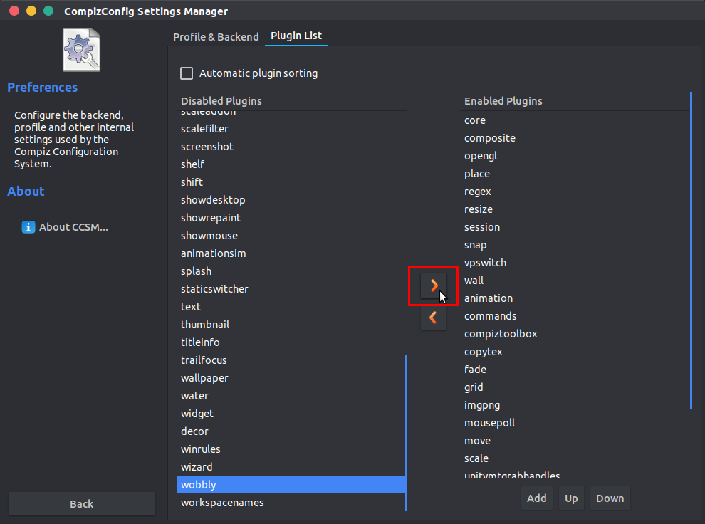
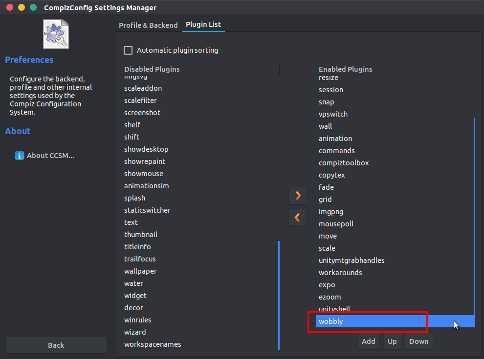

# Enable Wobbly Windows Effect

Type **ccsm** in the launcher and start **Compiz Config Settings Manager**

Select **Preferences**

Select **wobbly** from the left column

Click the right arrow to add **wobbly** to right column

Check if **wobbly** is visible at the bottom of the right column

Close the **CCSM** window. Wobbly windows should now be working.

### Note

* Wobbly windows will not work when the system is started in low-graphics mode. This can happen when booting from the live ISO, and when running in a Virtual Machine without 3-D acceleration.
* *Compiz Config Settings Manager (CCSM)* has issues with the Unity desktop. It is recommended to uninstall it after enabling wobbly windows.

