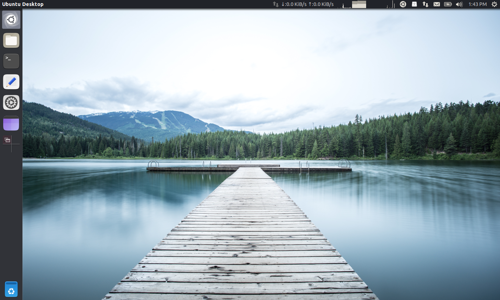
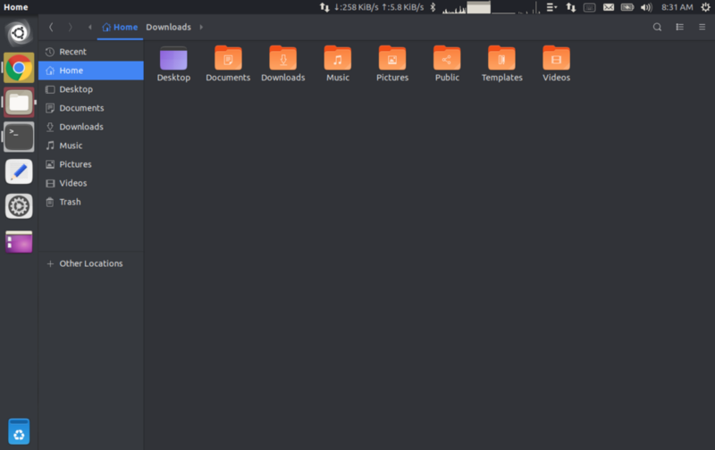
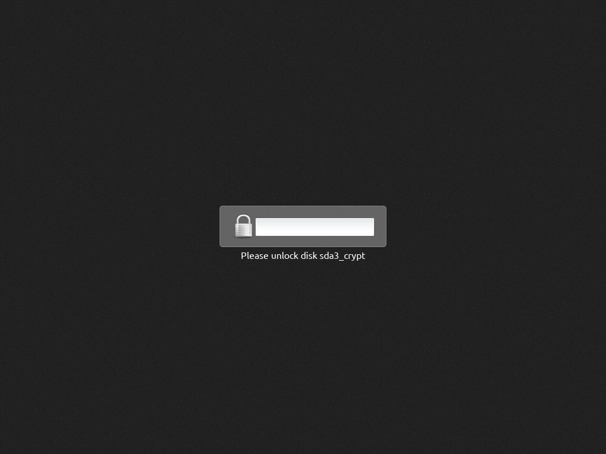
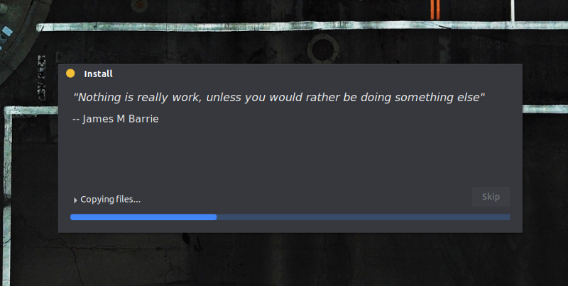
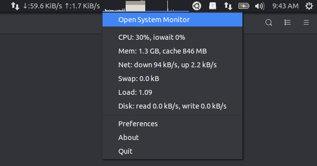
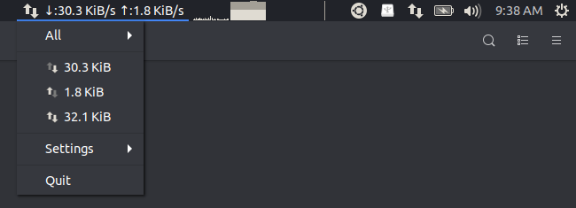
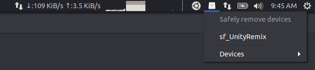
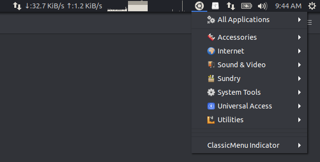

# Umix OS
Umix OS is a Linux distribution based on **Ubuntu 18.04 LTS** with **Unity 7** desktop. This distribution is for people who miss Unity, and who are not satisfied with other desktops that try to replicate the same experience.

Unity seems to be the only desktop with a global-menu implementation that works perfectly with all apps. Most desktops (MATE, GNOME, XFCE, ..) have a partially-broken global-menu that works with some apps and not with others. This makes them unusable as a daily driver.

Vertical screen space is something precious on widescreen displays. Combining the window buttons, title bar, and menu bar with the top panel is a basic necessity for maximising screen space and getting work done.

Even though Unity 7 is no longer actively developed, it is still being  maintained. It is currently stable on the Ubuntu 18.04 LTS platform and I’m hoping it continues to be stable on future LTS platforms.

## Features

- Unity 7 desktop 
- Based on Ubuntu 18.04 LTS (Bionic Beaver)
- Supports BIOS and UEFI installation (both offline and online)
- Integrated WiFi drivers (Broadcom)
- Refreshed ISOs available every 6 months (based on Bionic)
- Lightweight — Includes Google Chrome (with Adblock Plus), VLC Media Player, GParted, Synaptic and Tilix.
- Dark theme for reducing eye-strain
- Wobbly windows! 😃

## Screenshots

## Subscribe

***Umix*** is a paid distribution. A subscription is required for downloads. 

You can purchase a subscription for $11 using the link below:

This gives you the following benefits:

- 3 ISO editions (see section below)
- Refreshed ISO files with updated packages will be available every 6 months (in March and September). This saves time after installation, as fewer updates need to be downloaded.
- Subscription is valid for 2 years till the next Ubuntu LTS release in 2020. The last set of Umix ISOs based on Bionic will be released in Sep 2020, before moving to the next LTS base.
- ISO files are hosted on Google Drive. Please provide your GMail address when purchasing the subscription. It is not possible for me to provide torrents or alternative download links.
- This distribution is provided “as-is” without any support or warranty. Since Umix is based on Ubuntu 18.04, any issues you face will be common to Ubuntu, and you can find a solution by searching online.

## Editions

**Mini (1.5 GB)**— This edition is for regular users who need a lightweight system without too many pre-installed applications. It includes system utilities, Google Chrome, VLC Media Player, GParted, Synaptic, and Tilix. It does not include LibreOffice, Thunderbird, and other applications.

**Standard (2.0 GB)**— This edition is for regular users who need pre-installed apps for common tasks. It includes *LibreOffice* for office documents, *Thunderbird* for email, *GIMP* for editing images, *Geany* and *Diffuse* for editing code, *Pitivi* for editing videos, *Shutter* for screenshots, *Kazam* and *Peek* for screen recording, *Pidgin* for messaging, *Deluge* for torrents, *uGet* for downloads, etc.

**Current (1.5 GB)** — This is same as the “Mini” edition but based on the current Ubuntu release (18.10 Cosmic). A single Umix ISO will be available for the current release every 6 months.

[List of packages](https://drive.google.com/file/d/1qYqxm88AyoiI-Iro989_PrhzzKXd3Y2u/view?usp=sharing)

## Notes

1. The price of subscription is for the work involved in putting the distribution together and making sure that everything works correctly. If you don’t wish to pay for it, you can download the official Ubuntu ISO and customise it to your liking. There are many tutorials online for doing this. There are even some Unity-based distributions available. Purchasing a subscription saves you the time and effort of creating your own distribution.
2. The “Standard” edition is recommended for most users. It includes most apps that you will need to get work done.
3. Point updates for Ubuntu 18.04 will be available in Feb 2019, Aug 2019, Feb 2020, and Aug 2020. Refreshed ISOs for Umix will be released on the same schedule. These ISOs come with an updated HWE kernel and updated graphics stack.
4. There is no need to reinstall when new ISOs are released for Umix. You can keep your system updated by installing updates. Since it’s based on Ubuntu 18.04 you will continue to receive updates from the official Ubuntu repositories till 2023.
5. ISOs are tested to work on BIOS and UEFI systems in both offline and online mode (with or without internet connection). If you face an issue with installation you can let me know.
6. EFI installation was tested in a virtual machine. You may face issues depending on the hardware you are running it on. There are various issues reported by users when installing Ubuntu 18.04 on specific laptop models from Dell, HP, etc. If the official Ubuntu ISOs work for you then Umix will work as well, as they use the same installer.
7. Installing in EFI mode with secure-boot enabled is expected to work, but is untested. If the Ubuntu ISOs work for you then Umix will work as well.
8. If you have a Broadcom WiFi card, your WiFi should work out-of-the-box. If you have some card whose drivers are not included then you can let me know. I’ll include the drivers for it in the next release.

